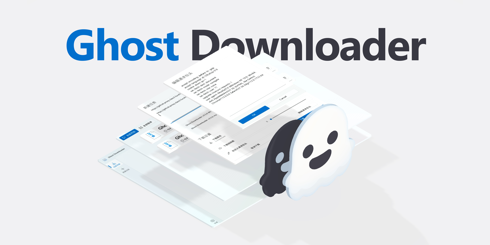

<h4 align="right">
  <a href="README_zh.md">简体中文</a> | English
</h4>

> [!NOTE]
> Due to academic commitments, development on this project has slowed down recently.

> [!TIP]
> If you want to use Ghost-Downloader-3 on Windows 7, please download version `v3.8.0-Windows7`.

> [!IMPORTANT]
> Welcome to join the Ghost Downloader user group: [756042420](https://qm.qq.com/q/gPk6FR1Hby)

<!-- PROJECT LOGO -->

<h3>
    AI-powered next-generation cross-platform multithreaded downloader
</h3>

[![Forks][forks-shield]][forks-url]
[![Stargazers][stars-shield]][stars-url]
[![Issues][issues-shield]][issues-url]
[![Release][release-shield]][release-url]
[![Downloads][downloads-shield]][release-url]

<h4>
  <a href="https://github.com/XiaoYouChR/Ghost-Downloader-3/issues/new?template=bug_report.yml">Report Bug</a>
·    
  <a href="https://github.com/XiaoYouChR/Ghost-Downloader-3/issues/new?template=feature_request.yml">Request Feature</a>
</h4>

<!-- ABOUT THE PROJECT -->
## About The Project

* A downloader built out of passion, and my first Python project 😣
* It was originally created to help a Bilibili creator integrate resources 😵‍💫
* It features IDM-style intelligent chunking without requiring file merging, plus AI smart acceleration 🚀
* Thanks to Python's🐍 accessibility, this project will open plugin🧩 support in the future (plugin API is still being stabilized...)

|    Platform    | Required Version |  Architectures   | Compatible |
|:--------------:|:----------------:|:----------------:|:----------:|
|  🐧 **Linux**  |  `glibc 2.35+`   | `x86_64`/`arm64` |     ✅      |
| 🪟 **Windows** |     `7 SP1+`     | `x86_64`/`arm64` |     ✅      |
|  🍎 **macOS**  |     `13.0+`      | `x86_64`/`arm64` |     ✅      |

> [!TIP]
> **Arch Linux AUR support**: Community-maintained packages `ghost-downloader-bin` and `ghost-downloader-git` are now available (Maintainer: [@zxp19821005](https://github.com/zxp19821005))

<!-- ROADMAP -->
## Roadmap

- ✅ Global settings
- ✅ More detailed download information
- ✅ Scheduled task support
- ✅ Browser extension optimization
- ✅ Global speed limiting
- ✅ Memory usage optimization
- ✅ Magnet / BT downloads
- ✅ Powerful browser extension features
- ✅ Powerful plugin support (API still needs to be stabilized...)
- ✅ Intelligent acceleration
- ✅ Use AsyncIO to reduce boilerplate
- ❌ Event-driven architecture refactor (Actor Model)
- ❌ Enhanced task editing (powerful features like binding multiple Sessions to one task)
- ❌ Support for eD2k protocol

Visit [Open issues](https://github.com/XiaoYouChR/Ghost-Downloader-3/issues) to see all requested features (and known issues).

<!-- SPONSOR -->
## Sponsor

|  | Free code signing provided by [SignPath.io](https://about.signpath.io/), with certificates by [SignPath Foundation](https://signpath.org/) |
|-------------------------------------------------------------------------------------|:---------------------------------------------------------------------------------------------------------------------------------------|

<!-- CONTRIBUTING -->
## Contributing

Contributions make the open source community an amazing place to learn, inspire, and create. Any contributions you make are **greatly appreciated**.

If you have a suggestion, fork the repo and create a pull request. You can also simply open an issue with the "Enhancement" tag. Don't forget to give the project a star⭐! Thanks again!

1. Fork the Project
2. Create your Feature Branch (git checkout -b feature/AmazingFeature)
3. Commit your Changes (git commit -m 'Add some AmazingFeature')
4. Push to the Branch (git push origin feature/AmazingFeature)
5. Open a Pull Request

Thanks to all contributors who have participated in this project!

## Translation Contributors

<!-- CROWDIN-CONTRIBUTORS-START -->
<table>
  <tbody>
    <tr>
      <td align="center" valign="top">
        <a href="https://crowdin.com/profile/XiaoYouChR">
           
          <b>XiaoYouChR</b></a>
         
        <b>13713 words</b>
      </td>
      <td align="center" valign="top">
        <a href="https://crowdin.com/profile/ReM2812">
           
          <b>ReM2812</b></a>
         
        <b>1010 words</b>
      </td>
      <td align="center" valign="top">
        <a href="https://crowdin.com/profile/i0ntempest">
           
          <b>Zhenfu Shi</b>
           
          <b>(i0ntempest)</b></a>
         
        <b>947 words</b>
      </td>
      <td align="center" valign="top">
        <a href="https://crowdin.com/profile/Dima88888">
           
          <b>Dima88888</b></a>
         
        <b>115 words</b>
      </td>
    </tr>
  </tbody>
</table>
<!-- CROWDIN-CONTRIBUTORS-END -->

<!-- SCREEN SHOTS -->
## Screenshots

<!-- LICENSE -->
## License

Distributed under the GPL v3.0 License. Open `LICENSE` for more details.

Copyright © 2025 XiaoYouChR.

<!-- CONTACT -->
## Contact

* [E-mail](mailto:XiaoYouChR@qq.com) - XiaoYouChR@qq.com
* [QQ Group](https://qm.qq.com/q/gPk6FR1Hby) - 756042420

<!-- ACKNOWLEDGMENTS -->
## References

* [aioftp](https://github.com/aio-libs/aioftp) Ftp client/server for asyncio
* [desktop-notifier](https://github.com/samschott/desktop-notifier) Python library for cross-platform desktop notifications
* [libtorrent](https://github.com/arvidn/libtorrent) An efficient feature complete C++ bittorrent implementation
* [loguru](https://github.com/Delgan/loguru) A library which aims to bring enjoyable logging in Python
* [niquests](https://github.com/jawah/niquests) Automatic HTTP/1.1, HTTP/2, and HTTP/3. WebSocket, and SSE included.
* [Nuitka](https://github.com/Nuitka/Nuitka) The Python compiler
* [PyQt-Fluent-Widgets](https://github.com/zhiyiYo/PyQt-Fluent-Widgets) Powerful, extensible, and elegant Fluent Design-style widget library
* [PySide6](https://github.com/PySide/pyside-setup) The official Python module

## Acknowledgments

* [@zhiyiYo](https://github.com/zhiyiYo/) is amazing and provided a lot of help for this project.
* [@空糖_SuGar](https://github.com/SuGar0218/) created the project banner.

<picture>
  <source
    media="(prefers-color-scheme: dark)"
    srcset="
      https://api.star-history.com/svg?repos=XiaoYouChR/Ghost-Downloader-3&type=Date&theme=dark
    "
  />
  <source
    media="(prefers-color-scheme: light)"
    srcset="
      https://api.star-history.com/svg?repos=XiaoYouChR/Ghost-Downloader-3&type=Date&theme=dark
    "
  />
  
</picture>

<!-- MARKDOWN LINKS & IMAGES -->
<!-- https://www.markdownguide.org/basic-syntax/#reference-style-links -->
[forks-shield]: https://img.shields.io/github/forks/XiaoYouChR/Ghost-Downloader-3.svg?style=for-the-badge
[forks-url]: https://github.com/XiaoYouChR/Ghost-Downloader-3/network/members
[stars-shield]: https://img.shields.io/github/stars/XiaoYouChR/Ghost-Downloader-3.svg?style=for-the-badge
[stars-url]: https://github.com/XiaoYouChR/Ghost-Downloader-3/stargazers
[issues-shield]: https://img.shields.io/github/issues/XiaoYouChR/Ghost-Downloader-3.svg?style=for-the-badge
[issues-url]: https://github.com/XiaoYouChR/Ghost-Downloader-3/issues
[product-screenshot]: app/assets/screenshot.png
[release-shield]: https://img.shields.io/github/v/release/XiaoYouChR/Ghost-Downloader-3?style=for-the-badge
[release-url]: https://github.com/XiaoYouChR/Ghost-Downloader-3/releases/latest
[downloads-shield]: https://img.shields.io/github/downloads/XiaoYouChR/Ghost-Downloader-3/total?style=for-the-badge
