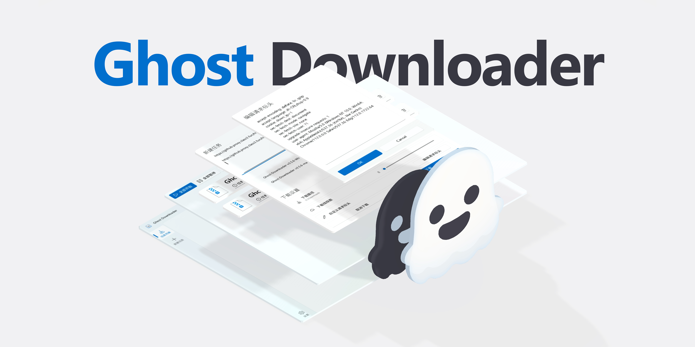

<h4 align="right">
  简体中文 | <a href="README.md">English</a>
</h4>
 
> [!IMPORTANT]
> 由于开发者高三冲刺，项目更新暂停😭 可加 QQ 群获取项目最新消息: [`531928387`](https://qm.qq.com/q/PlUBdzqZCm)

> [!NOTE]
> 本软件目前还存在着许多不足，仍在积极开发中...

> [!TIP]
> 如果您想在 Windows 7 上使用 Ghost-Downloader-3，请下载 `v3.5.8-Portable` 版本.

<!-- PROJECT LOGO -->

<h3>
    AI 赋能的新一代跨平台多线程下载器
</h3>

[![Forks][forks-shield]][forks-url]
[![Stargazers][stars-shield]][stars-url]
[![Issues][issues-shield]][issues-url]
[![Release][release-shield]][release-url]
[![Downloads][downloads-shield]][release-url]

<h4>
  <a href="https://github.com/XiaoYouChR/Ghost-Downloader-3/issues/new?template=bug_report.yml">Bug 报告</a>
·    
  <a href="https://github.com/XiaoYouChR/Ghost-Downloader-3/issues/new?template=feature_request.yml">功能需求</a>
</h4>

<!-- ABOUT THE PROJECT -->
## 关于本项目

* 在兴趣驱动下完成的一个下载器，是本人的第一个 Python 项目😣
* 本来的目的是帮 Bilibili 上一位 UP 主做资源整合的😵‍💫
* 特点是能像 IDM 一样智能分块但又不需要合并文件，以及 AI 智能加速🚀的功能
* 得益于 Python🐍 人人都可以开发的特性，本项目未来将会开放插件🧩功能，发挥 Python🐍 最大的优势

|       平台       |     版本要求      |       架构支持       | 兼容 |
|:--------------:|:-------------:|:----------------:|:--:|
|  🐧 **Linux**  | `glibc 2.35+` | `x86_64`/`arm64` | ✅  |
| 🪟 **Windows** |   `7 SP1+`    | `x86_64`/`arm64` | ✅  |
|  🍎 **macOS**  |    `11.0+`    | `x86_64`/`arm64` | ✅  |

> [!TIP]  
> **Arch Linux AUR 支持**：现已可通过社区维护的软件包 `ghost-downloader-bin` 和 `ghost-downloader-git` 进行安装（维护者：[@zxp19821005](https://github.com/zxp19821005)）

<!-- ROADMAP -->
## 计划

- ✅ 全局设置
- ✅ 更详细的下载信息
- ✅ 计划任务功能
- ✅ 浏览器插件优化
- ✅ 全局限速
- ✅ 内存占用优化
  - ✅ 升级 Qt 版本
  - ✅ 实现 HttpClient 复用
  - ✅ 用协程来代替部分多线程功能
- ❌ MVC → MVVM 以及由事件驱动的架构重构 (开发中...详见分支: feature/Plugins)
- ❌ 更强大的任务编辑功能 (一个任务绑定多个 Client 等强大功能)
- ❌ 磁力 / BT 下载 (考虑使用 libtorrent 实现)
- ❌ 强大的插件功能
- ❌ 强大的浏览器插件功能

到 [Open issues](https://github.com/XiaoYouChR/Ghost-Downloader-3/issues) 页面查看所有被请求的功能 (以及已知的问题) 。

<!-- SPONSOR -->
## 赞助商

|  | 由 [SignPath.io](https://about.signpath.io/) 提供免费代码签名，由 [SignPath Foundation](https://signpath.org/) 提供证书 |
|-------------------------------------------------------------------------------------|:---------------------------------------------------------------------------------------------------------|

<!-- CONTRIBUTING -->
## 贡献

贡献让开源社区成为了一个非常适合学习、启发和创新的地方。你所做出的任何贡献都是**受人尊敬**的。

如果你有好的建议，请分支（Fork）本仓库并且创建一个拉取请求（Pull Request）。你也可以简单地创建一个议题（Issue），并且添加标签「Enhancement」。不要忘记给项目点一个 Star⭐！再次感谢！

1. 复刻（Fork）本项目
2. 创建你的 Feature 分支 (git checkout -b feature/AmazingFeature)
3. 提交你的变更 (git commit -m 'Add some AmazingFeature')
4. 推送到该分支 (git push origin feature/AmazingFeature)
5. 创建一个拉取请求（Pull Request）

感谢所有为该项目做出贡献的人！

<!-- SCREEN SHOTS -->
## 截图

[![Demo Screenshot][product-screenshot]](https://space.bilibili.com/437313511)

<!-- LICENSE -->
## 许可证

根据 GPL v3.0 许可证分发。打开 `LICENSE` 查看更多内容。

Copyright © 2025 XiaoYouChR.

<!-- CONTACT -->
## 联系

* [E-mail](mailto:XiaoYouChR@qq.com) - XiaoYouChR@qq.com
* [QQ 群](https://qm.qq.com/q/PlUBdzqZCm) - 531928387

<!-- ACKNOWLEDGMENTS -->
## 引用

* [PyQt-Fluent-Widgets](https://github.com/zhiyiYo/PyQt-Fluent-Widgets) 强大、可扩展、美观优雅的 Fluent Design 风格组件库
* [Httpx](https://github.com/projectdiscovery/httpx) A fast and multi-purpose HTTP toolkit
* [Aiofiles](https://github.com/Tinche/aiofiles) File support for asyncio
* [Loguru](https://github.com/Delgan/loguru)  A library which aims to bring enjoyable logging in Python
* [Nuitka](https://github.com/Nuitka/Nuitka) The Python compiler
* [PySide6](https://github.com/PySide/pyside-setup) The official Python module
* [Darkdetect](https://github.com/albertosottile/darkdetect) Allow to detect if the user is using Dark Mode on
* [pyqt5-concurrent](https://github.com/AresConnor/pyqt5-concurrent) A QThreadPool based task concurrency library

## 致谢

* [@zhiyiYo](https://github.com/zhiyiYo/) 是大佬！为该项目的开发提供了很多帮助！
* [@一只透明人-](https://space.bilibili.com/554365148/) 测试了几乎从 Ghost-Downloader-1 开始的每个程序版本！
* [@空糖_SuGar](https://github.com/SuGar0218/) 制作了项目的 Banner！

<picture>
  <source
    media="(prefers-color-scheme: dark)"
    srcset="
      https://api.star-history.com/svg?repos=XiaoYouChR/Ghost-Downloader-3&type=Date&theme=dark
    "
  />
  <source
    media="(prefers-color-scheme: light)"
    srcset="
      https://api.star-history.com/svg?repos=XiaoYouChR/Ghost-Downloader-3&type=Date&theme=dark
    "
  />
  
</picture>

<!-- MARKDOWN LINKS & IMAGES -->
<!-- https://www.markdownguide.org/basic-syntax/#reference-style-links -->
[forks-shield]: https://img.shields.io/github/forks/XiaoYouChR/Ghost-Downloader-3.svg?style=for-the-badge
[forks-url]: https://github.com/XiaoYouChR/Ghost-Downloader-3/network/members
[stars-shield]: https://img.shields.io/github/stars/XiaoYouChR/Ghost-Downloader-3.svg?style=for-the-badge
[stars-url]: https://github.com/XiaoYouChR/Ghost-Downloader-3/stargazers
[issues-shield]: https://img.shields.io/github/issues/XiaoYouChR/Ghost-Downloader-3.svg?style=for-the-badge
[issues-url]: https://github.com/XiaoYouChR/Ghost-Downloader-3/issues
[product-screenshot]: resources/screenshot.png
[release-shield]: https://img.shields.io/github/v/release/XiaoYouChR/Ghost-Downloader-3?style=for-the-badge
[release-url]: https://github.com/XiaoYouChR/Ghost-Downloader-3/releases/latest
[downloads-shield]: https://img.shields.io/github/downloads/XiaoYouChR/Ghost-Downloader-3/total?style=for-the-badge
