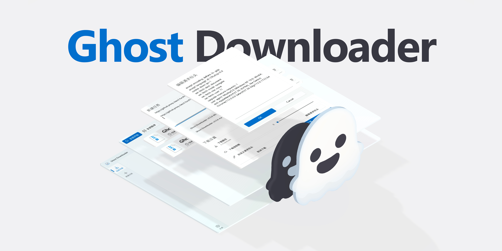

<h4 align="right">
  简体中文 | <a href="README.md">English</a>
</h4>

> [!TIP]
> 欢迎加入 Ghost Downloader Discord 社区: [discord.gg/fKfhkPumEM](https://discord.gg/fKfhkPumEM)

<!-- PROJECT LOGO -->

## 下载器的集大成者

[![AtomGit Stars][atomgit-stars-shield]][atomgit-stars-url]
[![Forks][forks-shield]][forks-url]
[![Stargazers][stars-shield]][stars-url]
[![Issues][issues-shield]][issues-url]
[![Release][release-shield]][release-url]
[![Downloads][downloads-shield]][release-url]

##### [使用文档](https://gd.xychr.com/zh/docs/) · [Bug 报告](https://github.com/XiaoYouChR/Ghost-Downloader-3/issues/new?template=bug_report.yml) · [功能需求](https://github.com/XiaoYouChR/Ghost-Downloader-3/issues/new?template=feature_request.yml)

<!-- FEATURES -->
## 功能特性

* **快在刀刃上。** 好网快是本分，烂网快才是本事。限速、拥堵、残损线路——别人卡死的地方，正是我们超车的弯道。
* **合，而不同。** 集大成，而不失其专。HTTP、磁力/BT、FTP、M3U8、MPEG-DASH、eD2k 全协议通吃；YouTube 与 Bilibili 框选片段、任意画质与字幕、播放列表与合集分 P，GitHub 与 HuggingFace 镜像加速：通用够广，专精够深。
* **所见即所得。** 下载按钮就长在视频上，不设画质上限；页面上的媒体，弹窗里一览无余。点一下，或照常在浏览器下载，桌面端都会接手，链接不用复制，登录状态原样带过去。
* **全平台，真原生。** 细节见真章。同一个软件，四个系统，处处恰到好处。
* **游刃有余。** 说变就变，说停就停。aria2 兼容 RPC，第三方工具直接推送；下载途中改链接、改请求头、改代理，已下的进度分毫不动。

<!-- ABOUT THE PROJECT -->
## 关于本项目

始于兴趣，最初是为了帮一位 B 站 UP 主整合资源。如今已覆盖四大平台、支持几乎所有主流下载协议，功能包插件体系也在逐步开放中。

| 平台 | 版本要求 | 架构支持 |
|:--|:--|:--|
|  **Linux** | `glibc 2.35+` | `x86_64` / `arm64` |
|  **Windows** | `10+` | `x86_64` / `arm64` |
|  **macOS** | `13.0+` | `x86_64` / `arm64` |
|  **Android** | `11.0+` | `arm64-v8a` |

> [!WARNING]
> 由于 Qt `6.6+` 已经不再支持 `不支持 AVX 指令集的 CPU`

> [!TIP]  
> **Arch Linux AUR 支持**：现已可通过社区维护的软件包 `ghost-downloader-bin` 和 `ghost-downloader-git` 进行安装（维护者：[@zxp19821005](https://github.com/zxp19821005)）

<!-- SCREEN SHOTS -->
## 截图

<!-- ROADMAP -->
## 计划

- [ ] 面向外部开发者公开插件 API（功能包体系已运作，API 稳定中）
- [ ] 更强大的任务编辑功能（一个任务绑定多个 Sessions 等）

到 [Open issues](https://github.com/XiaoYouChR/Ghost-Downloader-3/issues) 页面查看所有被请求的功能 (以及已知的问题) 。

<!-- SPONSOR -->
## 赞助商

| 标志 | 描述 |
|------|---|
|  | 由 [SignPath.io](https://about.signpath.io/) 提供免费代码签名，由 [SignPath Foundation](https://signpath.org/) 提供证书 |
|  | 由 [i0ntempest.com](https://i0ntempest.com/) 提供免费代码签名 |

<!-- CONTRIBUTING -->
## 贡献

贡献让开源社区成为了一个非常适合学习、启发和创新的地方。你所做出的任何贡献都是**受人尊敬**的。

如果你有好的建议，请分支（Fork）本仓库并且创建一个拉取请求（Pull Request）。你也可以简单地创建一个议题（Issue），并且添加标签「Enhancement」。不要忘记给项目点一个 Star！再次感谢！

1. 复刻（Fork）本项目
2. 创建你的 Feature 分支 (git checkout -b feature/AmazingFeature)
3. 提交你的变更 (git commit -m 'Add some AmazingFeature')
4. 推送到该分支 (git push origin feature/AmazingFeature)
5. 创建一个拉取请求（Pull Request）

感谢所有为该项目做出贡献的人！

## 翻译贡献者

> [!TIP]
> 如果你想为 Ghost Downloader 贡献翻译，欢迎前往 Crowdin 项目页: [ghost-downloader](https://crowdin.com/project/ghost-downloader)

<!-- CROWDIN-CONTRIBUTORS-START -->
<table>
  <tbody>
    <tr>
      <td align="center" valign="top">
        <a href="https://crowdin.com/profile/XiaoYouChR">
           
          <b>XiaoYouChR</b></a>
         
        <b>14249 words</b>
      </td>
      <td align="center" valign="top">
        <a href="https://crowdin.com/profile/i0ntempest">
           
          <b>i0ntempest</b></a>
         
        <b>1988 words</b>
      </td>
      <td align="center" valign="top">
        <a href="https://crowdin.com/profile/ReM2812">
           
          <b>ReM2812</b></a>
         
        <b>1010 words</b>
      </td>
      <td align="center" valign="top">
        <a href="https://crowdin.com/profile/Dima88888">
           
          <b>Dima88888</b></a>
         
        <b>115 words</b>
      </td>
    </tr>
  </tbody>
</table>
<!-- CROWDIN-CONTRIBUTORS-END -->

<!-- LICENSE -->
## 许可证

根据 GPL v3.0 许可证分发。打开 `LICENSE` 查看更多内容。

Copyright © 2024-2026 XiaoYouChR.

<!-- CONTACT -->
## 联系

> [!IMPORTANT]
> 欢迎加入 Ghost Downloader 用户交流群 [756042420](https://qm.qq.com/q/gPk6FR1Hby)

* [E-mail](mailto:XiaoYouChR@qq.com) - XiaoYouChR@qq.com

<!-- ACKNOWLEDGMENTS -->
## 引用

* [aioftp](https://github.com/aio-libs/aioftp) Ftp client/server for asyncio
* [cat-catch](https://github.com/xifangczy/cat-catch) 猫抓 浏览器资源嗅探扩展
* [desktop-notifier](https://github.com/samschott/desktop-notifier) Python library for cross-platform desktop notifications
* [FFmpeg](https://ffmpeg.org/) A complete, cross-platform solution to record, convert and stream audio and video
* [goed2k](https://github.com/monkeyWie/goed2k) The eD2k download daemon behind Ghost Downloader's eD2k support
* [libtorrent](https://github.com/arvidn/libtorrent) An efficient feature complete C++ bittorrent implementation
* [loguru](https://github.com/Delgan/loguru) A library which aims to bring enjoyable logging in Python
* [m3u8](https://github.com/globocom/m3u8) Python m3u8 parser
* [mpegdash](https://github.com/sangoma/mpegdash) MPEG-DASH MPD parser
* [N_m3u8DL-RE](https://github.com/nilaoda/N_m3u8DL-RE) Cross-platform DASH/HLS/MSS download tool powering Ghost Downloader's M3U8 support
* [Nuitka](https://github.com/Nuitka/Nuitka) The Python compiler
* [PyQt-Fluent-Widgets](https://github.com/zhiyiYo/PyQt-Fluent-Widgets) 强大、可扩展、美观优雅的 Fluent Design 风格组件库
* [PySide6](https://github.com/PySide/pyside-setup) The official Python module
* [QuickJS-NG](https://github.com/quickjs-ng/quickjs) A small and embeddable JavaScript engine
* [uvloop](https://github.com/MagicStack/uvloop) Ultra fast asyncio event loop
* [winloop](https://github.com/Vizonex/Winloop) An alternative to uvloop for Windows
* [wreq](https://github.com/0x676e67/wreq-python) An ergonomic Python HTTP client with TLS fingerprint emulation
* [yt-dlp](https://github.com/yt-dlp/yt-dlp) A feature-rich command-line audio/video downloader

## 致谢

* [@zhiyiYo](https://github.com/zhiyiYo/) 是大佬！为该项目的开发提供了很多帮助！
* [@空糖_SuGar](https://github.com/SuGar0218/) 制作了项目的 Banner！

## Star History

<a href="https://www.star-history.com/?repos=XiaoYouChR%2FGhost-Downloader-3&type=date&legend=top-left">
 <picture>
   <source media="(prefers-color-scheme: dark)" srcset="https://api.star-history.com/chart?repos=XiaoYouChR/Ghost-Downloader-3&type=date&theme=dark&legend=top-left&sealed_token=LFoHRo2s05TZoUPnYwYLjvXVdryi_dHus9oWAnLyuW3tytG-ZJ3cYCralCBqELLNt2yNjh53BVMVdHK2tiwQo9xJZIEIFC46B1sQc8ltFG3qOPVdV1Q2mTLijg4hnxQVSKGKGEgHEV8nrIHdcup8Y2wegyyuFkhoJfA2k9ZDaYorFXAOt-t57jGPBSTk" />
   <source media="(prefers-color-scheme: light)" srcset="https://api.star-history.com/chart?repos=XiaoYouChR/Ghost-Downloader-3&type=date&legend=top-left&sealed_token=LFoHRo2s05TZoUPnYwYLjvXVdryi_dHus9oWAnLyuW3tytG-ZJ3cYCralCBqELLNt2yNjh53BVMVdHK2tiwQo9xJZIEIFC46B1sQc8ltFG3qOPVdV1Q2mTLijg4hnxQVSKGKGEgHEV8nrIHdcup8Y2wegyyuFkhoJfA2k9ZDaYorFXAOt-t57jGPBSTk" />
   
 </picture>
</a>

<!-- MARKDOWN LINKS & IMAGES -->
<!-- https://www.markdownguide.org/basic-syntax/#reference-style-links -->
[forks-shield]: https://img.shields.io/github/forks/XiaoYouChR/Ghost-Downloader-3.svg?style=for-the-badge
[forks-url]: https://github.com/XiaoYouChR/Ghost-Downloader-3/network/members
[stars-shield]: https://img.shields.io/github/stars/XiaoYouChR/Ghost-Downloader-3.svg?style=for-the-badge
[stars-url]: https://github.com/XiaoYouChR/Ghost-Downloader-3/stargazers
[atomgit-stars-shield]: https://img.shields.io/badge/dynamic/xml?style=for-the-badge&label=AtomGit%20Stars&color=red&url=https%3A%2F%2Fgitcode.com%2FXiaoYouChR%2FGhost-Downloader-3%2Fstar%2Fbadge.svg&query=string%28%2F%2F*%5Blocal-name%28%29%3D%22span%22%20and%20contains%28%40class%2C%22star-num%22%29%5D%29
[atomgit-stars-url]: https://gitcode.com/XiaoYouChR/Ghost-Downloader-3
[issues-shield]: https://img.shields.io/github/issues/XiaoYouChR/Ghost-Downloader-3.svg?style=for-the-badge
[issues-url]: https://github.com/XiaoYouChR/Ghost-Downloader-3/issues
[release-shield]: https://img.shields.io/github/v/release/XiaoYouChR/Ghost-Downloader-3?style=for-the-badge
[release-url]: https://github.com/XiaoYouChR/Ghost-Downloader-3/releases/latest
[downloads-shield]: https://img.shields.io/github/downloads/XiaoYouChR/Ghost-Downloader-3/total?style=for-the-badge
