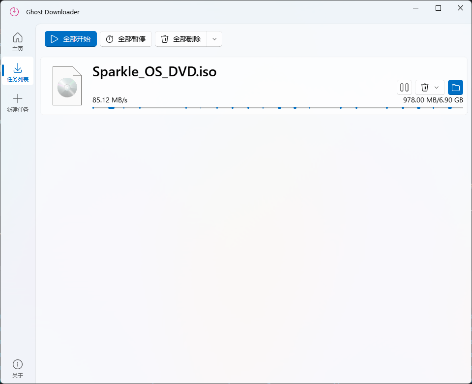

<!-- PROJECT LOGO -->

### Ghost-Downloader-3

[![Contributors][contributors-shield]][contributors-url]
[![Forks][forks-shield]][forks-url]
[![Stargazers][stars-shield]][stars-url]
[![Issues][issues-shield]][issues-url]
[![License][license-shield]][license-url]

一款多线程下载器

[汇报问题](https://github.com/XiaoYouChR/Ghost-Downloader-3/issues/new?labels=bug&template=bug-report---.md)
 | 
[请求功能](https://github.com/XiaoYouChR/Ghost-Downloader-3/issues/new?labels=enhancement&template=feature-request---.md)

<!-- LANGUAGE MENU-->

Language menu / 语言菜单

- [_en_US_ English](README.md)
- [_zh_CN_ 简体中文](README_zhCN.md)

<!-- SHOWCASE -->

展示

> 下载 _SparkleOS_ 镜像. 

<!-- TABLE OF CONTENTS -->

目录

[TOC]

<!-- INSTALL -->
## 安装

### 安装包

#### Windows
请前往 __Releases__ 下载 _EXE_ 安装包. 

#### Linux / Unix / MacOS
:construction: 暂无. :construction:

### 手动
:construction: 暂无. :construction:

<!-- USAGE -->
## 使用

:construction: 暂无. :construction:

<!-- ABOUT THE PROJECT -->
## 关于本项目

在兴趣驱动下完成的一个 __下载器__, 是本人的第一个`Python`项目:tired_face:, 本来的目的是帮B站上一位UP主做资源整合的:dizzy_face:. 

<!-- TECHNICAL DETAILS-->
## 技术细节

多线程使用`QThread`. 
使用`PySide6`编写 __GUI__. 
支持 __多线程下载__, __断点续传__, __下载记录__, __校验文件__ 等功能。
特点是能像`IDM`一样 __智能分块__ 但又 __不需要合并文件__ . 但是`Python`和`Qt`:shit:一样的内存占用成为项目很大的槽点:sob:. 

<!-- ROADMAP -->
## 计划

- [ ] __全局设置__
- [ ] 更详细的 __下载信息__
- [ ] __内存__ 占用优化
    - [ ] 更换UI库
    - [ ] 用 _协程_ 来代替部分多线程功能

到 [Open issues](https://github.com/XiaoYouChR/Ghost-Downloader-3/issues) 页面查看所有被 __请求的功能__ 以及 __已知的问题__. 

<!-- CONTRIBUTING -->
## 贡献

贡献让开源社区成为了一个非常适合学习, 启发和创新的地方. 你所做出的任何贡献都是 __受人尊敬__ 的. 

如果你有好的建议, 请Fork本仓库并且创建一个拉取请求Pull Request. 你也可以简单地创建一个议题Issue, 并且添加标签"_Enhancement_". 
不要忘记给项目点一个 :star: Star :star: 再次感谢! 

1. `Fork`本项目
2. 创建你的 Feature 分支
`git checkout -b feature/AmazingFeature`
3. 提交你的变更
`git commit -m 'Add some AmazingFeature'`
4. 推送到该分支
`git push origin feature/AmazingFeature`
5. 创建一个`Pull Request`

<!-- CONTACT -->
## 联系

- Bilibili  [@晓游ChR](https://space.bilibili.com/437313511)
- Mail      XiaoYouChR@outlook.com

<!-- ACKNOWLEDGMENTS -->
## 致谢

- [PyQt-Fluent-Widgets](https://github.com/zhiyiYo/PyQt-Fluent-Widgets) 很方便的 __UI库__
- [D2wnloader](https://github.com/DamageControlStudio/D2wnloader) 参考了此项目的代码
- [Best-README-Template](https://github.com/othneildrew/Best-README-Template) Best __README__ Template! 

<!-- MARKDOWN LINKS & IMAGES -->
[contributors-shield]: https://img.shields.io/github/contributors/XiaoYouChR/Ghost-Downloader-3.svg?style=for-the-badge
[contributors-url]: https://github.com/XiaoYouChR/Ghost-Downloader-3/graphs/contributors
[forks-shield]: https://img.shields.io/github/forks/XiaoYouChR/Ghost-Downloader-3.svg?style=for-the-badge
[forks-url]: https://github.com/XiaoYouChR/Ghost-Downloader-3/network/members
[stars-shield]: https://img.shields.io/github/stars/XiaoYouChR/Ghost-Downloader-3.svg?style=for-the-badge
[stars-url]: https://github.com/XiaoYouChR/Ghost-Downloader-3/stargazers
[issues-shield]: https://img.shields.io/github/issues/XiaoYouChR/Ghost-Downloader-3.svg?style=for-the-badge
[issues-url]: https://github.com/XiaoYouChR/Ghost-Downloader-3/issues
[license-shield]: https://img.shields.io/github/license/XiaoYouChR/Ghost-Downloader-3.svg?style=for-the-badge
[license-url]: https://github.com/XiaoYouChR/Ghost-Downloader-3/blob/master/LICENSE
[product-screenshot]: images/screenshot.png

